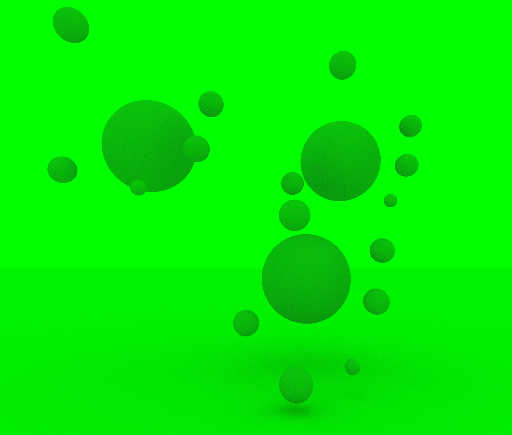

### This project was put together with help from the following articles:   
[GPU Ray Tracing in Unity - David Kuri](http://blog.three-eyed-games.com/2018/05/03/gpu-ray-tracing-in-unity-part-1/)   
[Ray Marching and Signed Distance Functions - Jamie Wong](http://jamie-wong.com/2016/07/15/ray-marching-signed-distance-functions/#the-raymarching-algorithm)   
[Distance Functions - Inigo Quilez](https://iquilezles.org/www/articles/distfunctions/distfunctions.htm)   
[Distance Estimated 3D Fractals - Mikael Christensen](http://blog.hvidtfeldts.net/index.php/about/)   
[Coding Adventure: Ray Marching - Sebastial Lague](https://www.youtube.com/watch?v=Cp5WWtMoeKg&ab_channel=SebastianLague)   
   
### screenshots from my adventures:   
Glass orbs

    
More glass orbs

   
Matte green

    
A bug with spectral reflection

    
A bug with refraction
